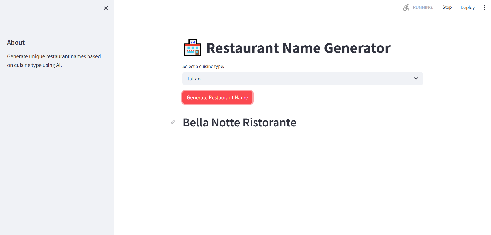

# Restaurant Name Generator

## Abstract

This project is a comprehensive implementation of an application for generating unique restaurant names using Large Language Models (LLMs) and the LangChain framework. The application also generates menu items for a restaurant and is deployed using Streamlit Community Cloud.

## Features

- Generate unique restaurant names based on selected cuisine.
- Generate a list of menu items for the restaurant.
- Interactive web interface built with Streamlit.

## Technologies Used

- **LangChain**: Framework for building applications powered by LLMs.
- **Streamlit**: Tool for building and deploying web applications.
- **HuggingFace Hub**: Source for pre-trained LLMs.

## Screenshot



## Setup Instructions

### 1. Setting Up the Environment

1. Install `uv` package manager:

   ```bash
   pip install uv
   ```
2. Sync the project dependencies using `uv`:

   ```bash
   uv sync
   ```

### 2. Loading Environment Variables

1. Obtain a HuggingFace API token from [HuggingFace](https://huggingface.co/).
2. Create a `.env` file in the project directory and add your token:
   ```env
   HUGGINGFACEHUB_API_TOKEN=your_token_here
   ```

### 3. Running the Application

1. Start the Streamlit app:
   ```bash
   streamlit run main.py
   ```
2. Open the provided local URL in your browser to interact with the app.

## Project Structure

- `main.py`: Contains the Streamlit app logic.
- `langchain_helper.py`: Encapsulates the logic for generating restaurant names and menu items using LangChain.
- `README.md`: Project documentation.

## How It Works

1. **Defining Prompt Templates**:
   - A prompt template is defined for generating restaurant names based on the selected cuisine.
   - Another template is defined for generating menu items based on the restaurant name.

2. **Creating Transformation Chains**:
   - `LLMChain` is used to create individual chains for generating restaurant names and menu items.
   - `SequentialChain` is used to combine these chains, ensuring the output of one chain serves as the input for the next.

3. **Building the App**:
   - Streamlit is used to create an interactive web interface.
   - Users can select a cuisine, and the app generates a restaurant name and menu items.

## Deployment

The app can be deployed to the Streamlit Community Cloud for public access. Follow the [Streamlit deployment guide](https://docs.streamlit.io/streamlit-community-cloud) for detailed instructions.

## Future Enhancements

- Add more cuisines and customization options.
- Improve the user interface with additional features.
- Integrate with external APIs for more dynamic content generation.

## License

This project is licensed under the MIT License.